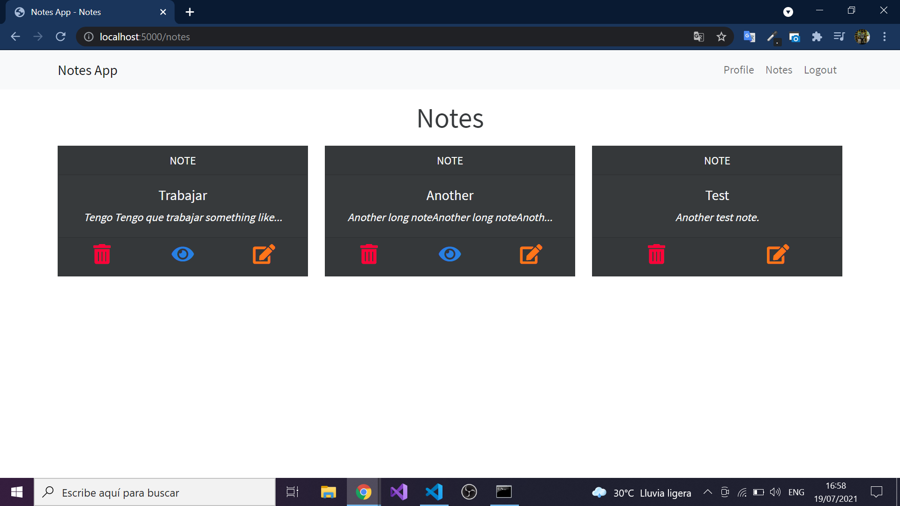

# Notes App with Node.js

This app is a CRUD in notes app, I use passport for Auth, Express.js for server and MongoDB for store data.
***You can see all dependencies in packages.json***



## How to run

*NOTE*
Make sure that of run mongoDB.

```sh
#For installing all dependencies.
$ node install
```

```sh
#For run the app.
$ node start
#Or for run with nodemon
$ npm run dev
```

- When you run the app then go to localhost:5000

## Features

- [x] Login System.
- [x] Authentication and Authorization.
- [x] Restrict to pages when is logged or you are not logged.
- [x] Create, read, update and delete a note.
- [x] When the text of the note is very long then a (eye) is added to the note and if you click it modal is open when the full text.
- [x] Interface with Bootstrap(Bootswatch theme, this is a backend practice project).